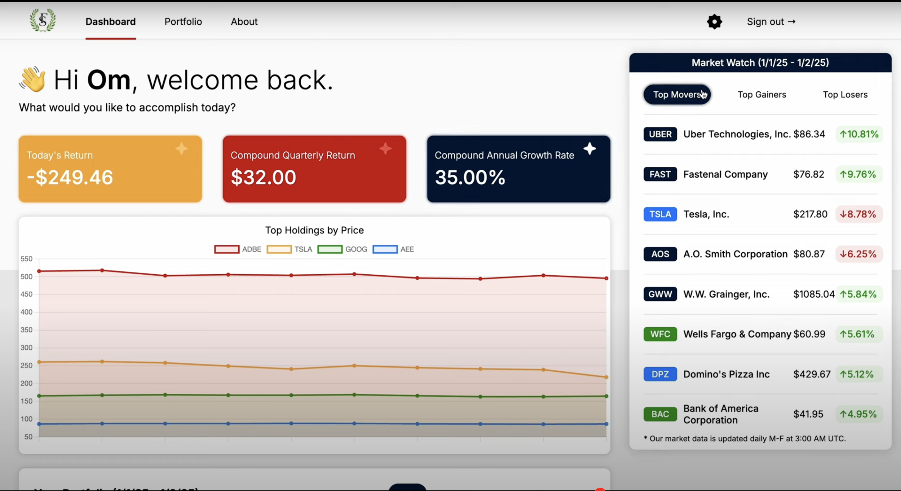

<h3>IMPORTANT: FinSight has been discontinued as of January 2, 2025 due to high database hosting costs. A demo video of the application in its full functionality can be found below.</h3>

<!-- PROJECT LOGO -->

  

<h1 align="center" font-size=36px>FinSight</h1>

  

    A financial portfolio management application that combines usability, reliability, and power.
     
  

<!-- TABLE OF CONTENTS -->

  
Table of Contents

  <ol>
    <li>
      <a href="#demo-video">Demo Video</a>
    </li>
    <li>
      <a href="#built-with">Built With</a>
    </li>
    <li>
      <a href="#features">Features</a>
    </li>
    <li><a href="#suggestions">Suggestions?</a></li>
  </ol>

### Demo Video 📼

  

<!-- BUILT WITH -->

### Built With ⚒️
* [![Java][Java.com]][Java-url]
* [![Spring Boot][SpringBoot.com]][SpringBoot-url]
* [![React][React.com]][React-url]
* [![TypeScript][TypeScript.com]][TypeScript-url]
* [![NodeJS][NodeJS.com]][NodeJS-url]
* [![PostgreSQL][PostgreSQL.com]][PostgreSQL-url]
* [![Docker][Docker.com]][Docker-url]

<!-- FEATURES -->

## Features 🏆
- Support for all stocks in the S&P 500.
- A RESTful API design, following architectural principles such as statelessness, separation of concerns, and the Model-View-Controller (MVC) pattern.
- A modern React interface with asset price visualization, card/list views for holdings, and market statistics.
- Intuitive UI elements for CRUD (Create, Read, Update, Delete) operations on data via HTTP requests.
- Automated daily price updates via a Node.js cron job with a GitHub Actions workflow to fetch and store daily asset prices.
- A PostgreSQL database running on a Docker container to store and access user and asset data efficiently.

### Suggestions? 💡
If you have a suggestion that would make FinSight better, feel free to contact me!

<!-- MARKDOWN LINKS & IMAGES -->
[Java.com]: https://img.shields.io/badge/Java-ED8B00?style=for-the-badge&logo=openjdk&logoColor=white
[Java-url]: https://www.java.com/en/
[SpringBoot.com]: https://img.shields.io/badge/SpringBoot-6DB33F?style=flat-square&logo=Spring&logoColor=white
[SpringBoot-url]: https://spring.io/projects/spring-boot
[React.com]: https://shields.io/badge/react-black?logo=react&style=for-the-badge
[React-url]: https://react.dev/
[TypeScript.com]: https://img.shields.io/badge/TypeScript-007ACC?logo=typescript&logoColor=white
[TypeScript-url]: https://www.typescriptlang.org/
[NodeJS.com]: https://img.shields.io/badge/node.js-6DA55F?style=for-the-badge&logo=node.js&logoColor=white
[NodeJS-url]: https://nodejs.org/en
[PostgreSQL.com]: https://img.shields.io/badge/PostgreSQL-316192?style=for-the-badge&logo=postgresql&logoColor=white
[PostgreSQL-url]: https://www.postgresql.org/
[Docker.com]: https://img.shields.io/badge/docker-%230db7ed.svg?style=for-the-badge&logo=docker&logoColor=white
[Docker-url]: https://www.docker.com/
